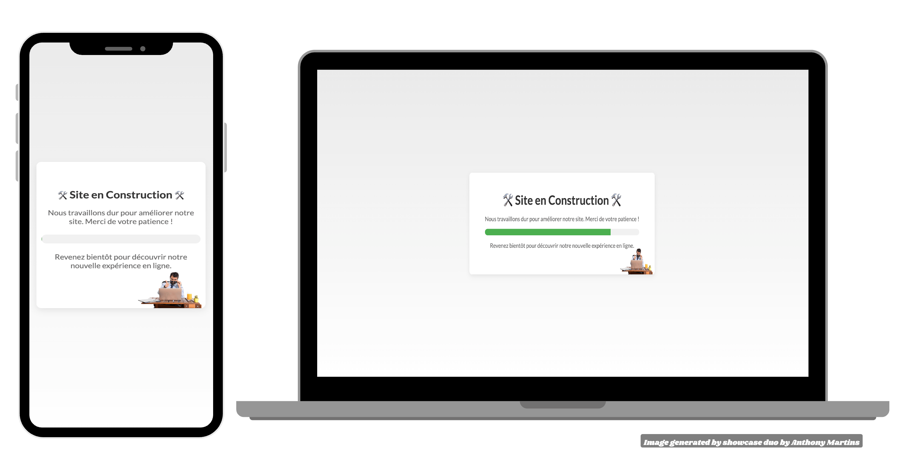

# website-under-construction

## Aperçu du projet

## Description du projet

Création d'une page 
 interactive pour informer les visiteurs que le site est en cours de développement.  Design moderne avec une animation subtile pour indiquer la progression des travaux.

## Démo en ligne

Vous pouvez consulter le projet en ligne via GitHub Pages : [website-under-construction sur GitHub Pages](https://martins-anthony.github.io/website-under-construction/)

## Auteur

  
